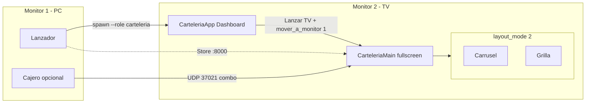

# PRD — Cartelería en 2 pantallas (cómo funcionaba)

> Complemento de `prd_carteleria_lanzador_tv.md`.  
> Detalla la lógica de **2 pantallas**: setup físico (PC + TV) y **modo layout 2** (carrusel + grilla).  
> Objetivo: clonar el comportamiento del último lanzamiento sin adivinar.

---

## 1. Dos conceptos que no hay que mezclar

| Concepto | Qué es | Dónde vive |
|----------|--------|------------|
| **A. 2 monitores físicos** | Caja/Lanzador en Monitor 1 + Cartelería fullscreen en Monitor 2 (TV) | `WindowManager`, Qt `QScreen`, spawn `--role carteleria` |
| **B. Layout modo 2** | Una sola ventana TV partida en **2 columnas**: Carrusel \| Grilla | `LayoutManager.layout_mode == 2` |

En el local típico se usan **los dos a la vez**: proceso cartelería en la TV (A) y, dentro de esa TV, a menudo modo 2 o 4 (B).

```
┌──────────────────── PC (Monitor 1) ────────────────────┐   ┌──────── TV (Monitor 2) ─────────┐
│  Lanzador / Cajero / Admin                             │   │  Cartelería fullscreen          │
│  proceso propio                                         │   │  proceso --role carteleria       │
└────────────────────────────────────────────────────────┘   │  ┌─modo2─┬─modo2─┐ o 1/3/4 cols │
                                                             │  │Carrusel│Grilla │              │
                                                             │  └───────┴───────┘              │
                                                             └─────────────────────────────────┘
```

---

## 2. Setup físico de 2 pantallas (paso a paso)

### Paso 1 — Hardware / Windows

1. PC POS con salida HDMI/DP a la TV.
2. Windows en **Extender estas pantallas** (no Duplicar).
3. Monitor 1 = caja (primary). Monitor 2 = TV (secondary).
4. Ideal: TV como pantalla extendida con su resolución nativa (FHD o 4K).

### Paso 2 — Arranque de procesos

```
1. Abrir Lanzador Maestro (queda en Monitor 1, arrastrable multi-pantalla)
2. Asegurar Store Server (MariaDB + LAN :8000) si esta PC es maestra
3. Click CARTELERÍA → spawn_role_process("carteleria")
4. En el proceso cartelería: Dashboard → Lanzar TV → showFullScreen()
5. Mover la ventana TV al Monitor 2 (ver Paso 3)
```

**Regla de producto:** Cartelería es proceso **aparte** del cajero.  
Así la caja no se congela si la TV pinta mucho, y cada uno puede vivir en su monitor.

### Paso 3 — Llevar la TV al segundo monitor

Código: `src/carteleria/motor_carteleria/window_manager.py`

#### 3.1 Flujo implementado de mover monitor

```
mover_a_monitor(screen_index):
  1. Ocultar selector flotante (si había)
  2. screens = QApplication.instance().screens()
  3. target = screens[screen_index]   # clamp a 0 si índice inválido
  4. geo = target.geometry()          # x,y,w,h absolutos del escritorio virtual
  5. top_window = CarteleriaMain.window()   # shell CarteleriaApp
  6. showNormal()                     # salir de FS antes de mover
  7. setGeometry(geo)                 # encajar en el rectángulo del monitor destino
  8. QTimer.singleShot(120ms, showFullScreen)
```

**Por qué el orden importa:** si se hace `setGeometry` en fullscreen, Windows/Qt a veces dejan la ventana a medias entre monitores. Primero `showNormal`, después geometry, después FS con delay 120 ms.

#### 3.2 Selector flotante (API lista)

`mostrar_selector_monitor()`:

1. Lista `app.screens()`.
2. Panel flotante centrado sobre la TV con un botón por monitor: `Monitor N — WxH`.
3. Resalta el monitor que contiene el centro de la ventana actual.
4. Click → `mover_a_monitor(i)`.
5. Auto-hide a los 8 s.

#### 3.3 Atajos actuales vs intención

| Tecla | Comportamiento actual en código | Intención documentada / UI del selector |
|-------|----------------------------------|----------------------------------------|
| **F10** | Toggle fullscreen ↔ ventana 900×600 | Comentario: “Selector de monitor / toggle”; nota del panel dice “F10 = fullscreen aquí” |
| **F11** | `request_screen(0)` → dashboard + `showNormal` | Salir de TV sin matar el proceso |
| **Esc** | En `CarteleriaApp`: volver dashboard + `showNormal` | Igual que F11 a nivel shell |

**Gap a clonar con cuidado:** `mostrar_selector_monitor` **existe** pero F10 hoy **no lo llama** (solo toggle FS).  
Para un clon fiel al “uso en local de 2 pantallas”, hay que elegir una de estas:

1. **Recomendada:** F10 abre selector si hay ≥2 screens; si hay 1 screen, solo toggle FS.  
2. Alternativa: botón en cabecera “Mover a monitor”.  
3. Alternativa operativa: arrastrar ventana (modo ventana) al Monitor 2 y F10 fullscreen.

El hub del lanzador ya soporta arrastre multi-pantalla (`mouseMoveEvent` con `globalPosition`).

### Paso 4 — Fullscreen correcto en la TV

Tras mover:

1. La ventana top-level (`CarteleriaApp`) debe quedar con geometry = screen 2.
2. `showFullScreen()` usa el screen donde está anclada la ventana.
3. Escala tipográfica/assets: `escala_tv.tv_scale_factor(widget)` usa `widget.screen()` → short side / 1080, clamp `[1.0, 2.5]`.
4. Fondos: `load_pixmap_for_size` + DPR; **no** `setScaledContents` (nitidez 4K).

### Paso 5 — Qué queda en cada pantalla

| Pantalla | Proceso | Contenido |
|----------|---------|-----------|
| Monitor 1 | Lanzador y/o `--role cajero` / admin | Cobro, stock, hub |
| Monitor 2 | `--role carteleria` | Precios públicos, promos, SOS, espía |

Comunicación entre pantallas (misma PC o red):

- Precios/config: Store API `:8000` + `carteleria_global` / cache.
- Combo en vivo: cajero UDP `:37021` → `EspiaWorker` en la TV.
- Heartbeat cartelería: UDP `:38000`.

No hace falta “pareja visual” Qt entre monitores: son procesos independientes.

---

## 3. Layout modo 2 — “2 pantallas” lógicas dentro de la TV

Código: `src/carteleria/motor_carteleria/layout_manager.py`

### Paso 1 — Entrar al modo 2

1. TV abierta (`CarteleriaMain`).
2. Cabecera `InfoNegocio` → botón **“Siguiente Vista”**.
3. `ciclar_layout()`: `layout_mode = (layout_mode % 4) + 1`.
4. Si estaba en SOS (`estado_sos_activo`) → **no cicla**.
5. Default al crear TV: `layout_mode = 4` (hay que ciclar 1→2→3→4 o varias veces hasta 2).

Ciclo: `1 → 2 → 3 → 4 → 1 …`

### Paso 2 — Qué muestra el modo 2

```
aplicar_layout() cuando layout_mode == 2:

  hide zona1, zona2, zona3, zona4
  limpiar QGridLayout
  stretch columnas en 0

  add zona1_carrusel  → (0, 0)   # columna izquierda
  add zona2_precios   → (0, 1)   # columna derecha
  show solo esas dos
  columnStretch(0)=1, columnStretch(1)=1   # 50% / 50%
  rowStretch(0)=1
  promo_manager.actualizar_pantallas_promocionales()  # en modo 2 no intercala 3/4
```

| Columna | Zona | Widget | Rol |
|---------|------|--------|-----|
| 0 | `zona1_carrusel` | `CarruselDestacados` | Top / destacados / publicidad inyectada |
| 1 | `zona2_precios` | `GrillaPrecios` | Lista de precios por categoría + ads |

`zona3` (Combos) y `zona4` (Chef Lobo) quedan **ocultas** en modo 2.

### Paso 3 — Escala de la grilla en modo 2

```
total_width = CarteleriaMain.width()
is_multimonitor = total_width > 5000 or layout_mode == 4
modo_grilla = 1 if is_multimonitor else layout_mode
zona2_precios.set_layout_mode(modo_grilla)
```

En **2 monitores normales** (ej. 1920+1920 o una sola TV 3840×2160):

- Ancho de la ventana TV ≈ 1920 o 3840 → **no** pasa 5000.
- Modo 2 → `modo_grilla = 2` → cards/banners a escala “media” (comparten ancho con carrusel).

Solo si la ventana supera **5000 px** de ancho (pared multi-TV) o estás en modo 4, la grilla se fuerza a `modo_tv=1` (tamaño “pantalla completa”) para legibilidad.

**Fix del último lanzamiento:** umbral 5000 (antes 2000). Una TV 4K (~3840) **no** debe tratarse como pared multi-monitor.

### Paso 4 — Comportamiento en runtime (modo 2)

Sigue activo el reloj maestro del PRD principal:

- Sync DB/cache.
- Rotación de contenido del carrusel / top10 + inyección publicidad.
- SOS fullscreen (stack página 1) — tapa las 2 columnas temporalmente.
- Espía combo (stack página 2) — igual, overlay total.
- Banderín volador overlay encima de las 2 columnas.
- **No** corre el intercalado Promo↔Chef Lobo (eso es solo modo 3).

### Paso 5 — Cuándo usar modo 2 en el local

| Escenario | Modo recomendado |
|-----------|------------------|
| 1 TV FHD/4K, querés precios + destacados sin saturar | **Modo 2** |
| Solo lista de precios legible | Modo 1 |
| TV ancha o querés combos + IA turnándose | Modo 3 |
| Pared 4 TVs / ultrawide / modo default actual | Modo 4 |

---

## 4. Relación con modos 1 / 3 / 4 (para no romper el clon)

| Modo | Columnas | Promos zona3/4 |
|------|----------|----------------|
| 1 | Solo grilla | ocultas |
| **2** | Carrusel + Grilla | ocultas |
| 3 | Carrusel + Grilla + 1 promo | `PromoManager` intercala zona3↔zona4 en col 2 |
| 4 | 4 columnas a la vez | ambas visibles; grilla en escala TV completa |

Modo 4 + ancho > 5000 = arquitectura “cada columna ≈ una TV” (comentario en `layout_manager`).

---

## 5. Diagrama — 2 pantallas físicas + modo 2



---

## 6. Checklist de aceptación — “2 pantallas como funcionaban”

### Físico (A)

1. Con Windows en Extender, Lanzador en M1 y Cartelería en M2 fullscreen sin tapar la caja.
2. `mover_a_monitor`: secuencia normal → geometry → FS 120 ms; sin ventana a caballo entre monitores.
3. Esc / F11 vuelven al dashboard del proceso cartelería **sin** cerrar el cajero del M1.
4. Segunda instancia del perfil cartelería bloqueada por `PerfilLocker`.
5. En TV 4K única, no se activa heurística multi-TV (`width > 5000`).

### Layout modo 2 (B)

6. “Siguiente Vista” llega a modo 2: exactamente 2 columnas 50/50, combos/IA ocultos.
7. Grilla usa `modo_tv=2` (no forzada a 1) en FHD/4K estándar.
8. SOS y Espía cubren toda la TV y al volver restauran el modo 2.
9. Publicidad sigue inyectándose en grilla/carrusel/banderín.
10. Durante SOS, el botón de ciclar layout no cambia el modo.

### Gaps a resolver al clonar

11. Decidir cableado de F10 → selector de monitor (hoy desconectado).
12. Opcional: recordar último `screen_index` en `config.json` (`carteleria_monitor_index`) y auto-mover al `lanzar_tv`.

---

## 7. Prompt corto para agente

```
Implementá / documentá Cartelería 2 pantallas según docs/prompts/prd_carteleria_2_pantallas.md.

A) Físico: proceso --role carteleria en Monitor 2 vía WindowManager.mover_a_monitor
   (showNormal → setGeometry(screen) → showFullScreen +120ms).
   Reconectá F10 al selector si hay ≥2 QScreen; 1 pantalla = toggle FS.
B) Lógico: layout_mode 2 = Carrusel|Grilla 50/50; zona3/zona4 ocultas;
   modo_grilla=2 salvo width>5000 o mode 4.
No mezclar con modo 3 (PromoManager) ni exigir cajero para precios.
```

---

## 8. Archivos tocados al clonar esta parte

| Archivo | Rol 2 pantallas |
|---------|-----------------|
| `window_manager.py` | Mover / FS / selector / F10 F11 |
| `layout_manager.py` | Modo 2 columnas + umbral 5000 |
| `main_board.py` | Orquesta managers; default mode 4 |
| `info_negocio.py` | Botón “Siguiente Vista” |
| `escala_tv.py` | Escala según `widget.screen()` |
| `hub_main.py` | Spawn + arrastre hub multi-monitor |
| `process_spawner.py` | Proceso autónomo para la TV |
| `candados.py` | 1 cartelería + 1 lanzador |

---

**Fin.** Usar junto con `prd_carteleria_lanzador_tv.md` para clonar el lanzamiento completo (boot + 2 pantallas).
