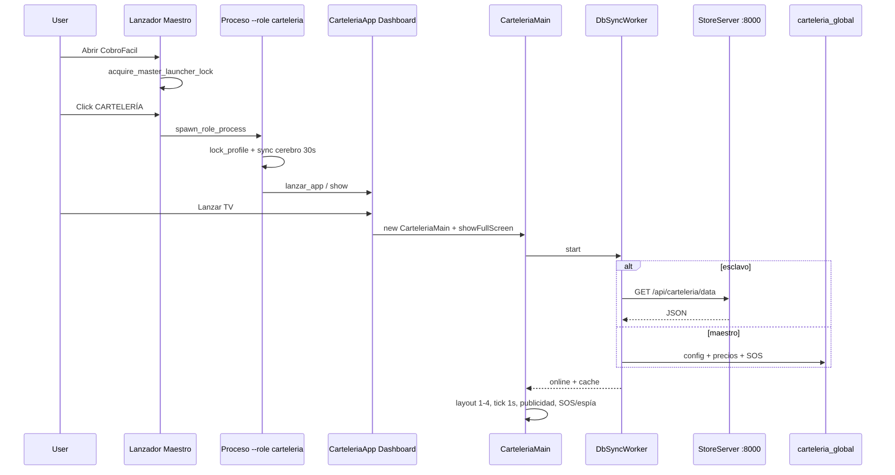

# PRD — Cartelería Lanzador TV (clonar último lanzamiento)

> Documento de requisitos y lógica de funcionamiento para **replicar / clonar** el comportamiento del último lanzamiento de Cartelería TV (cluster Agosto 2026, tip ≈ `v10.14.55`).  
> Audiencia: desarrollo e implementación. No es un manual de cajero.

**Ruta de producción canónica:** Lanzador Maestro → perfil `CARTELERÍA` → proceso autónomo `--role carteleria` → Dashboard → **Lanzar TV** fullscreen.

**Último lanzamiento (intención de producto):** inyección de publicidad + estabilidad TV/4K (DPI, clipping, freeze, arranque), no un rediseño greenfield.

**Complemento 2 pantallas:** ver `docs/prompts/prd_carteleria_2_pantallas.md` (PC+TV físico y layout modo 2).

---

## 1. Objetivo

Clonar, paso a paso, la lógica de:

1. Arranque desde el **Lanzador Maestro**.
2. Proceso autónomo de Cartelería (sin login).
3. Pantalla TV fullscreen con paneles, SOS, espía, publicidad y sync maestro/esclavo.
4. Blindajes del último release (4K, HiDPI, QtWebEngine, autoscroll nativo).

### 1.1 Fuera de alcance (salvo pedido explícito)

- Rediseño visual completo.
- Volver a HTML/QtWebEngine para promos (hoy es nativo: `DisplayPromoTV`).
- Exigir cajero abierto para sync esclavo (eliminado en v10.14.0).
- Reescribir inventario/ofertas embebidos en el shell (solo lazy embeds).

---

## 2. Mapa de archivos clave

| Área | Archivo | Responsabilidad |
|------|---------|-----------------|
| Entry global | `main.py` | Flags `--role`, lock lanzador, sync cartelería, `launch_app` |
| Lanzador hub | `src/lanzador/vistas/hub_main.py` | UI perfiles; click CARTELERÍA |
| Spawn | `src/lanzador/cerebro/process_spawner.py` | `spawn_role_process("carteleria")` |
| Candados | `src/utils/candados.py` | Instancia única lanzador + perfil |
| Shell autónomo | `src/carteleria/carteleria.py` | `CarteleriaApp` + `lanzar_app()` |
| Dashboard | `src/carteleria/dashboard/dashboard_main.py` | Botón Lanzar TV |
| Orquestador TV | `src/carteleria/motor_carteleria/main_board.py` | `CarteleriaMain` |
| Layout | `layout_manager.py` | Modos 1–4 + SOS |
| Ventana | `window_manager.py` | F10/F11, monitor, fullscreen |
| Sync | `db_sync_worker.py` | Cache/API/DB → UI |
| Grilla | `motor_grilla.py` + `grilla_precios.py` | Precios por categoría + autoscroll |
| Publicidad | `motor_publicidad.py` | `publicidad_config.json` |
| Promos nativas | `display_promo_tv.py` | Carrusel / relámpago sin HTML |
| Escala TV | `escala_tv.py` | Factor FHD→4K, pixmaps DPR |
| Cerebro | `cerebro_global/carteleria_cerebro/sincronizador_carteleria.py` | `productos` → `carteleria_global` (30s) |
| API LAN | `central_red_global/lan_server.py` | `/api/carteleria/*` |
| Espía caja | `services/carteleria_service.py` | UDP COMBO → `:37021` |

---

## 3. Flujo paso a paso — del lanzador a la TV

### Paso 0 — Precondiciones de entorno

1. PC maestra (o con Store Server alcanzable): MariaDB + LAN `:8000`.
2. `config.json` con claves de cartelería (ver §5).
3. En esclavo: `carteleria_is_slave=true` + `carteleria_master_ip` (o `db_host` remoto).
4. Assets PNG empaquetados (`assets_paths`); sin ellos la TV arranca pero degrada visualmente.
5. Tema: `carteleria_theme` = `temu` | `apple` (TV **no** usa QSS global del MainWindow).

### Paso 1 — Abrir Lanzador Maestro

```
main.py (sin --role)
  → heal update locks
  → QApplication + theme
  → acquire_master_launcher_lock()     # 1 sola instancia; si ya hay, enfoca
  → ensure_store_server_process()      # si es maestra / auto_start
  → launch_app(direct_role=None)
  → PerfilPantalla(is_master_launcher=True)
```

**Reglas:**

- Segundo click en el `.exe` del lanzador → traer al frente, no abrir otro hub.
- El lanzador **no posee** MariaDB: el proceso `--server` sobrevive al cierre del hub.
- Sync de cartelería en terminales sí; en lanzador solo si no hay Servidor dedicado.

### Paso 2 — Click perfil CARTELERÍA

```
PerfilPantalla
  → spawn_role_process("carteleria")
       frozen:  [exe, "--role", "carteleria"]
       dev:     [python, main.py, "--role", "carteleria"]
  → subprocess.Popen (proceso nuevo)
```

**Reglas:**

- No embeber la TV dentro del proceso del lanzador.
- El hub puede monitorear subprocesos; reinicios de perfil usan códigos `888`/`889`/`99` (máx. ~3).

### Paso 3 — Boot del proceso `--role carteleria`

```
main.py --role carteleria
  → NO spawnea store-server como dueño (solo se adjunta si corresponde)
  → init DB
  → start SincronizadorCarteleria (loop ~30s → carteleria_global)
  → PerfilLocker.lock_profile("carteleria")   # instancia única del perfil
  → init_network_engine("carteleria")
  → skip login
  → from src.carteleria.carteleria import lanzar_app
  → lanzar_app(app) → qt_exec(app)
```

**Reglas críticas del último lanzamiento:**

1. `__init__.py` de cartelería debe ser **lazy** (evitar crash del exe por imports pesados).
2. Cualquier import de `QtWebEngineWidgets` debe ir en `try/except ImportError` (hotfix `54018a2`): un PC sin WebEngine no puede tumbar toda la app.
3. Fallo al construir paneles no debe dejar sintaxis rota en `grilla_precios` (hotfix arranque TV).

### Paso 4 — Shell `CarteleriaApp` (Dashboard)

```
lanzar_app
  → opcional init_lan_server
  → CarteleriaApp (QStackedWidget)
  → muestra Dashboard
  → aplica tema admin al shell (no al canvas TV interno)
```

Páginas del stack (lazy):

| Señal dashboard | Destino |
|-----------------|---------|
| `request_launch_tv` | `CarteleriaMain` fullscreen |
| `request_admin_tv` | Config panel cartelería |
| `request_inventario` | Inventario (permisos forzados admin) |
| `request_ofertas` | Motor descuentos |
| `request_red_lan` | Red LAN |
| `request_proveedores` | Proveedores |
| Esc / F11 (`request_screen`) | Volver dashboard + `showNormal()` |

### Paso 5 — `lanzar_tv()` (entrada a pantalla)

Orden obligatorio:

1. Si existe `tv_main` anterior → `removeWidget` + `deleteLater` (recrear para aplicar tema).
2. `from ...main_board import CarteleriaMain` (import diferido).
3. Instanciar `CarteleriaMain()`.
4. Conectar `request_screen` → `volver_dashboard`.
5. `setCurrentWidget(tv_main)`.
6. `showFullScreen()`.

### Paso 6 — Construcción de `CarteleriaMain`

Orden de montaje:

1. Leer `carteleria_theme` (`apple` | `temu`).
2. Fondo:
   - `temu` → gradiente de tema.
   - `apple` → `macos_bg.png` vía `escala_tv.load_pixmap_for_size` (**prohibido** `setScaledContents` blurry).
3. Zonas UI:
   - Cabecera: `InfoNegocio` (nombre, reloj, indicador red, ciclo layout).
   - Zócalo: `Mensaje`.
   - `CarruselDestacados`.
   - `GrillaPrecios`.
   - `PanelCombos`.
   - `PanelIA` (Chef Lobo).
4. Stack de páginas:
   - `0` normal
   - `1` `OfertaRelampago` (SOS)
   - `2` `PantallaEspia`
5. Overlay: `BanderinVolador`.
6. `layout_mode` default = **4** (cuatro columnas).
7. Arrancar workers (Paso 7).

### Paso 7 — Workers y red al vivo

| Worker | Cuándo | Qué hace |
|--------|--------|----------|
| `DbSyncWorker` | al inicio + cada ~10s si idle | Slave HTTP o DB local → `carteleria_cache.json` → señal online/offline |
| `EspiaWorker` | continuo UDP `:37021` | Combo en vivo desde caja |
| `ClimaWorker` | master, ~1h | Clima cabecera |
| `MotorGrilla` / paneles | ~16–30s | Leen `carteleria_global` |
| Heartbeat | 0.5s + cada 10s | UDP `:38000` `carteleria\|HEARTBEAT\|{}` |
| NetworkEngine UI | ~0.8s | Indicador de red |

### Paso 8 — Sync de datos (maestro vs esclavo)

**Esclavo** (`carteleria_is_slave` o `db_host` remoto):

```
GET http://{master_ip}:8000/api/carteleria/data
  fallback: /carteleria_cache.json
→ escribir carteleria_cache.json
→ emitir online
```

**Maestro / DB local:**

```
tabla carteleria_config  OR  config.json
+ SOS (precio_oferta_relampago > 0)
+ precios por categoría
+ top10 (API real en lan_server; fallback random en DbSyncWorker)
→ cache → online
```

**Fallo de red/DB:** leer cache local → estado `"offline"` (TV sigue mostrando último snapshot).

Al terminar sync (`_on_db_sync_finished`):

1. Actualizar nombre negocio + zócalo.
2. Aplicar timers: `rotacion_ms`, `tiempo_sos_ms`, `frec_sos` (≥3 efectivo).
3. Lista SOS.
4. Si hash de precios cambió → disparar motor grilla.
5. Guardar `datos_destacados` para banderín.

### Paso 9 — Layout modes (1–4)

| Modo | Columnas visibles |
|------|-------------------|
| 1 | Solo grilla |
| 2 | Carrusel + Grilla |
| 3 | Carrusel + Grilla + (Combos **o** Chef Lobo vía `PromoManager`) |
| 4 | Las cuatro |

**Multimonitor / pared ancha:**

- Heurística: `width > 5000` **o** modo 4 → grilla en `modo_tv=1` (cards tamaño TV completo).
- Umbral **5000** (antes 2000): evita falso positivo en TV 4K única → overflow/freeze (`5693442`).

Ciclo layout: botón en `InfoNegocio` → `LayoutManager.ciclar_layout` (**bloqueado durante SOS**).  
**No** rotar layouts normales automáticamente; solo SOS / alternancia zona3↔zona4 (`4802c19`).

### Paso 10 — Reloj maestro (1s) — ciclo de vida en pantalla

Cada tick `_tick_reloj_maestro`:

| Intervalo | Acción |
|-----------|--------|
| cada 10s | Heartbeat + reiniciar `DbSyncWorker` si idle |
| cada 3600s | Clima (solo master) |
| cada `rotacion_ms/1000` (~15s) | `_ciclo_inteligente`: `PromoManager.rotar` + SOS cada `frec_sos` ciclos normales |
| cada 35s | `BanderinVolador.lanzar` (cada 4º vuelo = publicidad) |

### Paso 11 — Motor de publicidad (feature del último lanzamiento)

Fuente: `publicidad_config.json`

```json
{ "promocionados": ["ACEITUNA", "CARCAZA", "HUEVO X 6U"] }
```

Match: substring `promo in nombre.lower()`.

Inyecciones:

1. **Grilla:** cada 4 cards de producto (y 1× por categoría si no hubo) → `TarjetaPublicidad`; render en chunks (15 widgets / 16ms) anti-freeze.
2. **Carrusel:** `inyectar_en_top10` fuerza nombre promocionado en slot 1 si falta (tolerar precio `0`).
3. **Banderín:** cada 4º lanzamiento → texto “PRODUCTO PROMOCIONADO”.
4. Admin: `DialogGestorPublicidad` en módulo ofertas/descuentos.

### Paso 12 — SOS (Oferta Relámpago)

Condición: productos con `precio_oferta_relampago > 0`.

1. Tras N ciclos normales (`frec_sos`) → stack página 1.
2. Mostrar `OfertaRelampago` / `DisplayPromoTV` por `tiempo_sos_ms`.
3. Labels dinámicos: forzar `repaint()` + opacidad (anti overwrite HiDPI, `ad67c2e`).
4. Volver a página normal; layout cycle sigue bloqueado mientras SOS activo.

### Paso 13 — Espía (combo en vivo desde caja)

```
Cajero CarteleriaService
  → UDP broadcast :37021 (COMBO / limpiar)
  → EspiaWorker filtra por caja_id
  → pausar rotación
  → PantallaEspia ~6s
  → restaurar
```

Opcional para sync de precios; diferenciador de producto si hay cajero en red.

### Paso 14 — Controles de ventana / monitor

| Tecla / acción | Efecto |
|----------------|--------|
| Esc | Dashboard + `showNormal` |
| F11 | Salir fullscreen / pedir dashboard |
| F10 | Toggle fullscreen |
| Picker monitor | `WindowManager.mover_a_monitor` |

Escala tipográfica/imagen: `escala_tv.tv_scale_factor` = `short_side / 1080` clamp `[1.0, 2.5]`.

---

## 4. Blindajes obligatorios del último lanzamiento (checklist clone)

Al clonar / portar, **debe** conservarse:

1. **Autoscroll grilla = QWidget nativo** — no `QScrollArea` (clipping/sangrado 4K escalado, `0274cf4`).
2. **Sin `setMask` en `GrillaPrecios`** — usaba mask y sangraba texto (`c69f28b`). Preferir márgenes.
3. **Umbral multimonitor `>5000`** — no `>2000`.
4. **Promo QLabels:** `repaint()` + opacity en carrusel y SOS.
5. **Una sola clase `_AutoScrollList`** — fusionar lógica; evitar duplicados que rompen `set_items`.
6. **Import seguro QtWebEngine** — nunca tumbar proceso cartelería/lanzador.
7. **Chunk orchestrator** al inyectar muchas `TarjetaPublicidad` (anti freeze UI).
8. **Lazy imports** en `src/carteleria/__init__.py` y en `lanzar_tv`.
9. **Slave sin cajero:** Store Server solo alcanza para precios/config.
10. **Performance mode** (`carteleria_performance_mode`): desactivar sombras/efectos pesados en PCs débiles.

Riesgo residual conocido: `TarjetaPublicidad` aún puede usar `setMask` — al clonar, alinear con el fix de grilla.

---

## 5. Contratos de datos

### 5.1 `config.json` (claves cartelería)

```json
{
  "carteleria_theme": "temu",
  "carteleria_is_slave": true,
  "carteleria_master_ip": "192.168.0.5",
  "carteleria_rotacion": 15,
  "carteleria_tiempo_sos": 10,
  "carteleria_frec_sos": 2,
  "carteleria_performance_mode": false,
  "mensaje_zocalo": "",
  "business_name": "Mi Negocio",
  "phone": "",
  "db_host": "192.168.0.5",
  "is_master": false,
  "caja_id": "6",
  "auto_start_store_server": false,
  "gemini_api_key": ""
}
```

### 5.2 `publicidad_config.json`

```json
{
  "promocionados": ["NOMBRE PRODUCTO 1", "NOMBRE PRODUCTO 2"]
}
```

### 5.3 `carteleria_cache.json` / `GET /api/carteleria/data`

```json
{
  "config": {
    "business_name": "string",
    "phone": "string",
    "carteleria_rotacion": 15,
    "carteleria_tiempo_sos": 10,
    "carteleria_frec_sos": 2,
    "mensaje_zocalo": "string"
  },
  "sos": [
    {
      "nombre": "string",
      "precio": 0.0,
      "precio_oferta": 0.0,
      "precio_oferta_relampago": 0.0,
      "precio_oferta_promedio": 0.0,
      "cant_oferta": 0.0,
      "tipo_unidad_oferta": "Unidades",
      "stock": 0.0
    }
  ],
  "precios": [],
  "top10": { "hoy": [], "semana": [], "mes": [] }
}
```

Filas pueden llegar como **tuple legacy o dict** — la UI debe aceptar ambos.

### 5.4 Tabla `carteleria_global`

Campos lógicos: `(departamento, nombre_producto, precio_normal, precio_oferta, regla_texto)`.  
`regla_texto` puede traer HTML corto tipo “Llevando N Kilos/Unidades”.

### 5.5 Puertos

| Puerto | Protocolo | Uso |
|--------|-----------|-----|
| 8000 | TCP | API Store `/api/carteleria/data\|grilla\|config_update` |
| 37020 | UDP | Discovery maestro |
| 37021 | UDP | Espía / combo |
| 38000 | UDP | Heartbeat cartelería |

---

## 6. Diagrama de secuencia (clon mínimo)



---

## 7. Criterios de aceptación (clon = “igual al último lanzamiento”)

1. Hub lanza proceso cartelería; segunda instancia del mismo perfil es bloqueada/gestionada por locker.
2. Dashboard → TV fullscreen en el monitor elegido; Esc/F10/F11 como §14.
3. Grilla scrollea continuo **sin sangrado** en 3840×2160 @ 150% DPI Windows.
4. Esclavo solo con Store Server online muestra precios vivos en ≤ ~30s; offline usa cache.
5. SKUs de `publicidad_config.json` aparecen como cards amarillas en grilla y periódicamente en banderín.
6. SOS rota cuando hay `precio_oferta_relampago > 0`; UDP combo muestra espía ~6s.
7. PC sin QtWebEngine: cartelería/lanzador **no** se cierran.
8. TV 4K única no se congela por heurística multimonitor falsa.
9. Temas `temu`/`apple` aplican al recrear TV; no dependen del QSS global del cajero.

---

## 8. Decisiones abiertas al clonar en otro repo/rama

| Tema | Recomendación |
|------|----------------|
| Entry dual (autónomo + tabs MainWindow 21/22) | Primario = autónomo; tabs solo admin/jefe |
| `DialogoEsperaConexion` (UDP discovery UI) | Opcional; hoy no está en boot de `lanzar_app` |
| Unificar top10 | Preferir rankings reales de `lan_server` también en path local |
| Ownership gestor publicidad | Ofertas module vs admin cartelería — documentar un dueño |
| Tests | Aceptación en **TV 4K real + DPI escalado Windows**; unit tests no alcanzan |

---

## 9. Prompt corto para agente implementador

```
Cloná Cartelería Lanzador TV del último lanzamiento CobroFacil (docs/prompts/prd_carteleria_lanzador_tv.md).

Obligatorio:
- Spawn desde hub: --role carteleria, PerfilLocker, sin login.
- Shell CarteleriaApp → lazy CarteleriaMain fullscreen.
- Sync slave HTTP :8000 + cache offline; master DB + carteleria_global 30s.
- Layouts 1–4, SOS, espía UDP :37021, publicidad_config.json con chunk render.
- 4K: autoscroll QWidget nativo, sin setMask en grilla, umbral multimonitor >5000,
  repaint/opacity en QLabels de promo, ImportError seguro en QtWebEngine.
- escala_tv sin setScaledContents en fondos.
No rediseñes UI. No dependas del cajero para sync de precios.
```

---

## 10. Referencia de commits del último cluster

| Commit | Tema |
|--------|------|
| `7fda322` | Motor publicidad + chunk orchestrator + TarjetaPublicidad |
| `3ec947b` | Ship `publicidad_config.json` |
| `5693442` | Multimonitor 2000→5000 |
| `c69f28b` | Quitar setMask grilla |
| `0274cf4` | Autoscroll nativo (anti QScrollArea 4K) |
| `ad67c2e` | repaint/opacity promos HiDPI |
| `c249926` / `255bf27` | Hotfix arranque TV / _AutoScrollList |
| `54018a2` | ImportError QtWebEngine |
| `2fdece4` | `escala_tv` + DPI exe |
| `0c7eac1` | Esclavo sin cajero |

---

**Fin del PRD.** Usar este documento como checklist de implementación y de QA al clonar el lanzamiento.
